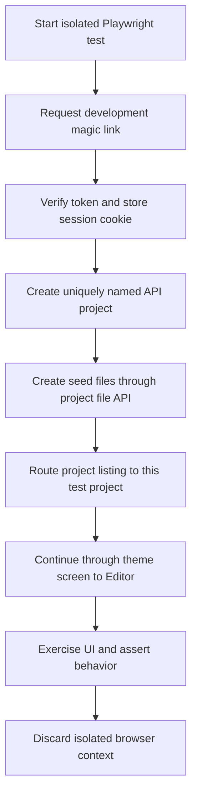

# Devpulse Playwright Editor E2E Report

**Report date:** 2026-09-26  
**Status:** Test implementation complete; browser execution blocked by the local environment and known application gaps.

## Executive Summary

Devpulse is a pnpm/Turborepo monorepo for a cloud development platform. Its web app is built with Next.js and React; the editor workbench uses Monaco and integrates with an Express API, PostgreSQL through Prisma, Redis, an AI service, and Socket.IO. Docker Compose describes the local infrastructure.

This work adds a Playwright setup and 24 independent browser tests across the six requested editor areas: file origins, AI apply, usage limits, loading states, session restoration, and save conflicts. The E2E dependency, test commands, per-test development authentication, unique project creation, and seed-file helpers are in place.

TypeScript validation and Playwright test discovery succeeded. The browser suite has not completed: Chromium was unavailable, its installation was interrupted, and the Docker Engine/API were unavailable in this environment. Two assertions also expose application behavior that needs implementation before all requested expectations can pass.

## Project Context

The repository includes these main parts:

| Area                     | Role                                                                                       |
| ------------------------ | ------------------------------------------------------------------------------------------ |
| `apps/web`               | Next.js product UI, editor workbench, AI panel, and client state                           |
| `apps/api`               | Express API for authentication, projects, files, revisions, usage, and platform operations |
| `apps/ai`                | AI service integration                                                                     |
| `apps/socket`            | Socket.IO collaboration service                                                            |
| `apps/mobile`            | Expo mobile-client foundation                                                              |
| `packages/database`      | Prisma schema, migrations, seed data, and database client                                  |
| PostgreSQL, Redis, MinIO | Persistence, ephemeral state, and object storage for local development                     |

The editor supports project files, local files, newly created files, Monaco editing, revision-backed saves, AI responses and apply previews, usage meters, loading/error/empty states, local session state, and save-conflict resolution. The wider platform also includes repository and workspace screens, deployments, execution, team chat, and remote-control UI. The broader project status is documented in `PROJECT_PROGRESS.md` and `PROJECT_DOCUMENTATION.md`.

## Delivered Playwright Work

- Added `apps/web/playwright.config.ts` with `http://localhost:3000` as the default base URL, 30-second test timeout, one retry in CI, retained failure traces, failure screenshots, and a managed web dev server.
- Added `@playwright/test` to the web package and updated `pnpm-lock.yaml`.
- Added root and web package scripts for standard, UI, headed, and editor-only E2E runs.
- Added per-test development authentication, unique project creation, API seed-file creation, and editor navigation helpers.
- Added 24 tests across six spec files. Each test creates its own page context, authenticates, and creates a unique project or mocks the relevant response.
- Added ignore entries for generated `playwright-report` and `test-results` output.

### Coverage Map

| Spec                      |  Tests | Main scenarios                                                                                |
| ------------------------- | -----: | --------------------------------------------------------------------------------------------- |
| `file-origins.spec.ts`    |      4 | API origin, local origin and autosave exclusion, new-file prompt, before-unload guard         |
| `ai-apply.spec.ts`        |      5 | Apply target selection, diff preview, language mismatch, successful apply, truncated response |
| `usage-limits.spec.ts`    |      4 | Normal usage, low-usage warning, exhausted input, unauthenticated usage response              |
| `loading-states.spec.ts`  |      5 | Delayed loading, empty project, recent files, API failure/offline path, large local file      |
| `session-restore.spec.ts` |      3 | Active session restore, local-file exclusion, missing-file handling                           |
| `save-conflicts.spec.ts`  |      3 | Conflict details, force-save mine, reload theirs                                              |
| **Total**                 | **24** | **Six spec files**                                                                            |

## Test Setup and Flow

Each test establishes its own browser context and follows this basic flow:



For specific behaviors, tests intercept API responses with `page.route()`. Examples include usage counts, AI chat SSE chunks, apply outcomes, loading delays, project errors, editor sessions, and save conflicts. This keeps those cases deterministic and independent of model-provider or billing state.

Development authentication uses the API's actual magic-link flow with the seeded `demo@devpulse.local` account. In development, the magic-link endpoint returns a verification token; verifying it sets the API session cookie. This account is associated with the seeded demo workspace.

The test project helper creates projects through `POST /v1/projects`, then adds seed files through `POST /v1/projects/:projectId/files`. The browser project-list request is routed to the newly created project because the current app loads the first project returned by the API.

## Commands

Run from the repository root:

```bash
pnpm install
pnpm test:e2e
pnpm test:e2e:editor
pnpm test:e2e:headed
pnpm test:e2e:ui
```

The config starts the web app with `pnpm --filter @devpulse/web dev` unless a local server is already available. The API and infrastructure services must also be running. The repository's development instructions describe service startup and database seeding in `DEVELOPMENT.md`.

Environment overrides:

- `PLAYWRIGHT_BASE_URL` changes the browser base URL; the default is `http://localhost:3000`.
- `PLAYWRIGHT_API_URL` changes the API host used by the auth and project fixtures; the default is `http://localhost:4000`.
- `CI` enables one retry and the GitHub reporter.

Playwright's Chromium binary must be installed on a machine before browser tests can launch. For example:

```bash
pnpm --dir apps/web exec playwright install chromium
```

## Verification Results

| Check                                                           | Result        | Notes                                                                |
| --------------------------------------------------------------- | ------------- | -------------------------------------------------------------------- |
| `pnpm install`                                                  | Passed        | Playwright dependency installed and workspace lockfile updated       |
| `pnpm --dir apps/web exec tsc --noEmit`                         | Passed        | Config, fixtures, and specs typecheck                                |
| `pnpm --dir apps/web exec playwright test tests/editor/ --list` | Passed        | Discovered 24 tests in six files                                     |
| `git diff --check`                                              | Passed        | No whitespace errors                                                 |
| Full editor browser run                                         | Not completed | All initial cases stopped before launch because Chromium was missing |
| Chromium install                                                | Interrupted   | Download reached approximately 67%, then was stopped                 |
| API health at `localhost:4000`                                  | Unavailable   | Connection failed                                                    |
| Docker Compose service check                                    | Blocked       | Docker Engine named pipe was unavailable on this machine             |

The failed Playwright attempt did **not** evaluate the tests or the application: `browserType.launch` failed because the Chromium executable did not exist. It should not be interpreted as 24 product test failures.

## Blockers and Contract Differences

### Environment blockers

1. Docker Desktop/Engine was unavailable. The API health endpoint did not respond, so project creation, authentication, and API-backed browser flows could not run.
2. Chromium was not installed. Its download was started but interrupted before completion.
3. Therefore, there is no full browser pass/fail result yet. The tests need to be rerun after Docker services and Chromium are available.

### Application/API differences from the requested setup

1. There is no `GET /api/auth/dev-bypass` endpoint. The fixtures use the API's development magic-link request and verification endpoints instead. This creates an API session cookie, unlike the client-only development login button.
2. The app is served at `/`; it does not expose a dedicated `/editor` route or read a `project` query parameter. Tests navigate through the theme screen and select their project by routing the project-list response.
3. `POST /v1/projects` accepts a project name and optional workspace ID; it does not accept the requested `template: "blank"` field. The fixture creates the project in the default workspace and seeds files separately.
4. AI code application uses `POST /v1/ai/apply`, which persists the AI application/revision. It does not issue the requested `PATCH /v1/files/:fileId` call for that workflow. The test observes the endpoint the current editor actually calls.

### Behaviors likely to fail the requested assertions

- When the usage endpoint returns 401, the current usage hook ignores the non-OK response and leaves the usage panel in its loading state. The re-authentication prompt test is expected to fail until that error state is implemented.
- The large-file test expects AI input and submission to remain disabled after the user chooses “Open anyway.” The current component appears to clear the large-file block on that action, so this assertion is expected to fail until the intended restriction is implemented.

These are product behavior gaps, not Playwright setup failures. They are deliberately captured as assertions rather than hidden by mocking UI state.

## Recommended Next Steps

1. Start Docker Desktop and the required services; follow the database migration and seed steps in `DEVELOPMENT.md`.
2. Install the Playwright Chromium binary.
3. Run `pnpm test:e2e:editor` and triage failures after browser launch. Fix fixture or selector issues separately from application behavior failures.
4. Implement the usage 401/re-authentication state and confirm the intended large-file AI restriction; rerun the relevant specs.
5. Confirm whether the product should add `/editor?project=...` routing and a named dev-bypass endpoint, or retain the currently tested root-navigation and magic-link contracts.
6. Once the Docker-backed suite passes locally, run the same command in CI with the configured retry and report settings.

## Completion Assessment

The requested Playwright configuration, scripts, fixtures, and editor test files are present. Static TypeScript checks and test discovery pass. Browser-level verification and the two noted application behaviors remain outstanding, so the E2E implementation is not yet fully verified against a running local stack.
