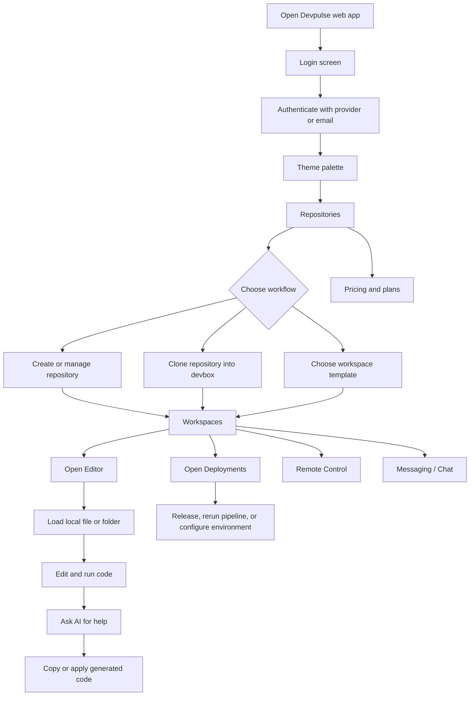
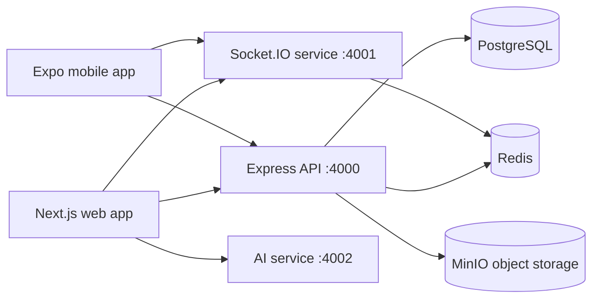

# Devpulse Project Documentation

## 1. Project Overview

Devpulse is a Turborepo monorepo for a cloud development platform. **Devpulse** is the canonical product name across the repository and web interface, and is positioned around:

- Cloud workspaces and isolated development environments (devboxes).
- Git repository management and branch-aware workflows.
- Browser-based source editing.
- AI-assisted coding.
- Deployments, CI/CD configuration, logs, and environment variables.
- Team messaging and collaborative remote control.
- A mobile client foundation.

The repository combines a polished interactive web application with runnable service foundations for an API, real-time communication, AI requests, PostgreSQL persistence, Redis, and MinIO object storage.

## 2. Achievements

### Product and UX

- Built a complete sign-in entry experience with GitHub, GitLab, SSO/SAML, and work-email actions.
- Added live-looking telemetry on the login screen, including latency and available instance counts.
- Added an onboarding sequence from login to theme selection and then repositories.
- Built a consistent dark developer-tool interface with responsive Tailwind layouts and Lucide icons.
- Added a global application shell with top navigation, repository/branch context switching, status indicators, user profile access, and sidebar navigation.
- Added a command palette entry point using `Ctrl+K` UI affordance.
- Added a theme token screen with primary, secondary, tertiary, and neutral color ramps.
- Added monthly and annual pricing states with Free, Pro, and Enterprise tiers plus FAQ content.

### Repository and workspace management

- Added repository search by name and description.
- Added filters for language and starred repositories.
- Added repository creation, deletion, starring, clone URL copying, and deployment navigation.
- Added devbox provisioning from an existing repository.
- Added devbox provisioning from templates for Next.js, FastAPI, Rust, Go, and PyTorch workloads.
- Added a local-machine connection workflow with a CLI install command and WireGuard-oriented messaging.
- Added workspace status controls, deletion, template metadata, resource information, ports, and preview URLs.

### Editing and AI-assisted development

- Added a VS Code-inspired editor workbench.
- Added local file loading through the browser File API.
- Added local folder loading through the browser directory picker.
- Added new-file creation, file deletion, open-file tabs, dirty-file state, and editable file contents.
- Added a Docker-isolated code execution flow with stdout, stderr, exit code, timeout, and error results.
- Added an in-editor AI drawer backed by the Anthropic service with project/file/branch context.
- Added a full-screen AI Studio with model switching, context chips, temperature/top-p controls, service-backed responses, copy actions, and revision-backed apply-to-editor navigation.
- Added an active code context model for files, packages, and branches.

### Deployments and operations

- Added active deployment cards with branch, commit, status, target, timestamp, and duration data.
- Added new production release and pipeline rerun actions.
- Added deployment tabs for overview, deployments, environment variables, preview branches, pipelines, and access/audit views.
- Added environment-variable creation, deletion, search, masking/reveal controls, and copy actions.
- Added deployment logs with clear and auto-scroll behavior.
- Added live-looking latency, container health, success-rate, and sync metrics.
- Added deploy-on-push and ephemeral preview branch controls.

### Collaboration

- Added team channels, direct-message navigation, online presence indicators, and message composition.
- Added messages containing code snippets, attachments, reactions, roles, and avatars.
- Added a remote-control workspace with two screen panes, editable shared code, host/controller identities, session timer, latency, typing presence, microphone/camera controls, and stop-session navigation.
- Added Socket.IO workspace rooms, Redis-backed presence/session state, code-change broadcasts, cursor/selection events, and typing events.

### Platform foundation

- Established a pnpm workspace and Turborepo layout for multiple applications and shared packages.
- Added TypeScript configuration, shared ESLint configuration, Tailwind configuration, and reusable package boundaries.
- Added an Express API service with Helmet, CORS, JSON parsing, request logging, health, readiness, project/file CRUD, revision-backed saves, artifact uploads, and execution endpoints.
- Added an AI service with Anthropic integration and a `/v1/chat` endpoint.
- Added a Prisma PostgreSQL schema for users, workspaces, membership roles, projects, files, file revisions, channels, and messages.
- Added Docker Compose services for PostgreSQL, Redis, MinIO, web, API, Socket.IO, AI, and mobile development, with Redis and MinIO connected to application services.
- Added development, build, test, lint, typecheck, migration, seed, and Prisma Studio commands.
- Added an Expo mobile application shell that can run on Android, iOS, or web.

## 3. End-to-End User Flow



### Flow details

1. **Entry and authentication:** The initial page is controlled by `AppContext`. Provider buttons redirect through the API OAuth routes, while the development magic-link flow verifies through Redis and establishes an HTTP-only JWT session.
2. **Theme setup:** The user selects or customizes design tokens. Applying the theme moves the user to repository management.
3. **Repository setup:** The user searches existing repositories, filters them, creates a repository, stars it, copies its clone URL, or launches a devbox.
4. **Workspace provisioning:** A user can import a Git URL, choose a supported template, or connect a local machine. The resulting workspace appears in the workspace list with status and resource metadata.
5. **Development:** The editor can open browser-selected files/folders, create files, update content, run code in the API sandbox, and open an AI coding drawer.
6. **AI assistance:** AI Studio provides model/context controls and returns code-oriented responses. A generated patch can be copied or routed back to the editor.
7. **Delivery:** Deployments show release state, build information, environment variables, logs, pipeline controls, and operational metrics.
8. **Collaboration:** Team Chat provides channels and direct messages. Remote Control provides a split collaborative coding view with presence and session controls.

## 4. Architecture



### Applications

| Application | Location                   | Responsibility                 | Current state                                                                                      |
| ----------- | -------------------------- | ------------------------------ | -------------------------------------------------------------------------------------------------- |
| Web         | [apps/web](apps/web)       | Main Next.js product interface | API-backed editor and platform resource state with local fallback                                  |
| API         | [apps/api](apps/api)       | HTTP backend                   | Auth, project/file, repository, devbox, deployment, environment, artifact, and execution endpoints |
| Socket      | [apps/socket](apps/socket) | Real-time collaboration        | Workspace sessions, presence, code, cursor, and typing events                                      |
| AI          | [apps/ai](apps/ai)         | Anthropic proxy                | Health endpoint and `/v1/chat` request forwarding                                                  |
| Mobile      | [apps/mobile](apps/mobile) | Expo client foundation         | Branded starter screen with Expo targets configured                                                |

### Shared packages

- `packages/config`: shared project configuration.
- `packages/database`: Prisma schema, client generation, migrations, and seed scripts.
- `packages/eslint`: shared lint configuration.
- `packages/types`: shared TypeScript types.
- `packages/ui`: shared UI package boundary.
- `packages/utils`: shared utility package boundary.

## 5. Frontend State and Data Flow

The web application uses `AppProvider` and `useApp()` as its central state boundary. The main state categories are:

- Navigation: current `PageType` and page transitions.
- Identity: API-restored user profile, OAuth/magic-link login, and logout state.
- Design: active theme and available themes.
- Repositories: list, search query, filter, add, delete, and star actions.
- Workspaces: devbox list, provisioning, status toggling, and deletion.
- Deployments: releases, pipeline reruns, environment variables, and logs.
- Editor: tree files, open files, active file, file contents, file creation/deletion, local file loading, and diff application.
- Collaboration: remote code, control state, microphone/camera state, and remote session state.
- Billing: monthly/annual pricing selection.

The page router is intentionally lightweight: [apps/web/app/page.tsx](apps/web/app/page.tsx) selects a screen based on `page`, while [apps/web/app/context/AppContext.tsx](apps/web/app/context/AppContext.tsx) owns cross-screen behavior and demo data.

The editor is now connected to the API. On editor entry, the web client discovers or creates a project, loads its file metadata and contents, saves edits through `PATCH /v1/files/:fileId`, imports local files into persistent project files, and deletes files through the API. AI apply actions use the same save path, creating a new `FileRevision`.

## 6. Data Model

The Prisma schema in [packages/database/prisma/schema.prisma](packages/database/prisma/schema.prisma) defines:

- `User`: identity and relationships to memberships, owned workspaces, and messages.
- `Workspace`: team boundary, slug, plan, owner, projects, channels, and memberships.
- `WorkspaceMember`: workspace membership and `OWNER`, `ADMIN`, `MEMBER`, or `GUEST` role.
- `Project`: workspace project with a default branch and files.
- `File`: project file content, language, version, and revision history.
- `FileRevision`: immutable file version records with optional author.
- `Channel`: public, private, or direct conversation channel.
- `Message`: channel message with author, body, timestamps, edit state, and deletion state.

The schema provides persistence for authenticated users, workspaces, repositories represented by projects, editor files/revisions, devboxes, deployments, environment variables, and collaboration channels.

## 7. Editor API

| Method   | Endpoint                                | Purpose                                                                |
| -------- | --------------------------------------- | ---------------------------------------------------------------------- |
| `GET`    | `/v1/projects`                          | Discover editor projects                                               |
| `POST`   | `/v1/projects`                          | Create a project in the first or requested workspace                   |
| `GET`    | `/v1/projects/:projectId/files`         | List project files                                                     |
| `GET`    | `/v1/projects/:projectId/files/:fileId` | Read file content                                                      |
| `POST`   | `/v1/projects/:projectId/files`         | Create a file and its first revision                                   |
| `PATCH`  | `/v1/files/:fileId`                     | Save content, rename, move, or change language                         |
| `DELETE` | `/v1/files/:fileId`                     | Delete a file and revisions                                            |
| `POST`   | `/v1/projects/:projectId/artifacts`     | Store larger base64 project artifacts in MinIO                         |
| `POST`   | `/v1/execute`                           | Execute JavaScript, Python, Rust, or Go in an ephemeral Docker sandbox |
| `GET`    | `/v1/repositories`                      | List persisted repository projects                                     |
| `POST`   | `/v1/repositories`                      | Create a persisted repository project                                  |
| `GET`    | `/v1/devboxes`                          | List persisted devboxes                                                |
| `POST`   | `/v1/devboxes`                          | Provision a persisted devbox record                                    |
| `GET`    | `/v1/deployments`                       | List persisted deployments                                             |
| `POST`   | `/v1/deployments`                       | Create a persisted deployment record                                   |
| `GET`    | `/v1/environment-variables`             | List persisted project environment variables                           |

File content saves increment `File.version` and create a matching `FileRevision` in one Prisma transaction. Execution requests run without network access, with CPU, memory, process, read-only filesystem, temporary filesystem, and timeout limits. Short-lived execution results are cached in Redis.

## 8. Local Development

### Requirements

- Node.js 20.10 or newer.
- pnpm 9.15 or newer through Corepack.
- Docker Desktop.

### Standard startup

```bash
corepack enable
pnpm install
copy .env.example .env
docker compose up -d postgres redis minio
pnpm migrate
pnpm seed
pnpm dev
```

### Local endpoints

| Service       | URL                          |
| ------------- | ---------------------------- |
| Web           | http://localhost:3000        |
| API health    | http://localhost:4000/health |
| Socket health | http://localhost:4001/health |
| AI health     | http://localhost:4002/health |
| MinIO console | http://localhost:9001        |

### Useful commands

```bash
make build
make test
make lint
make typecheck
make migrate
make studio
```

More detailed operational instructions are available in [DEVELOPMENT.md](DEVELOPMENT.md).

## 9. Current Implementation Status

### Implemented and demonstrable

- The web navigation and screen composition are implemented.
- Editor projects, files, saves, revisions, imports, deletes, AI requests, and execution requests now cross service boundaries.
- Remote Control now joins a Socket.IO workspace and exchanges session, presence, code, cursor, and typing events.
- The API, Socket.IO, and AI services can start independently and expose their documented base endpoints.
- The database schema is modeled for multi-user persistence and collaboration.
- Docker Compose describes the complete local service topology and wires Redis/MinIO into the services that use them.

### Still foundational or simulated

- SAML/SSO and production magic-link email delivery still require provider configuration and an email delivery integration.
- The web falls back to local demo state only when the API is unavailable; persistent repository, devbox, deployment, and environment actions use the API when available.
- Devbox provisioning and deployment execution persist real state, but the underlying container fleet and CI workers remain infrastructure stubs.
- The execution service currently supports JavaScript, Python, Rust, and Go source snippets; full framework boot workflows for Next.js, FastAPI, and PyTorch still require dedicated project runners.
- AI response streaming is not enabled yet; the UI shows an explicit generating state while waiting for the non-streaming Anthropic response.
- OAuth provider callbacks and JWT session restoration are implemented; production secrets, callback registration, and email delivery still need deployment configuration.
- Billing remains a client-side pricing experience without payment-provider persistence.
- The mobile application is a starter shell and does not yet mirror the web workflows.
- **Devpulse** is the canonical product name across the repository, web interface, and mobile client.

These boundaries are important for planning the next implementation phase: connect the existing screens to authenticated API contracts, persistent Prisma data, real provider integrations, secure execution infrastructure, and Socket.IO client events.

## 10. Primary Reference Files

- [README.md](README.md): short project description and quick start.
- [DEVELOPMENT.md](DEVELOPMENT.md): local development and service instructions.
- [package.json](package.json): root scripts and workspace tooling.
- [apps/web/app/page.tsx](apps/web/app/page.tsx): top-level web screen routing.
- [apps/web/app/context/AppContext.tsx](apps/web/app/context/AppContext.tsx): shared web state and demo actions.
- [apps/web/app/components/AppShell.tsx](apps/web/app/components/AppShell.tsx): global navigation and workbench shell.
- [apps/web/app/components/EditorWorkbench.tsx](apps/web/app/components/EditorWorkbench.tsx): browser editor and in-editor AI flow.
- [apps/web/app/components/DeploymentsPage.tsx](apps/web/app/components/DeploymentsPage.tsx): releases, pipelines, environment variables, and logs.
- [apps/api/src/index.ts](apps/api/src/index.ts): HTTP API foundation.
- [apps/api/src/index.test.ts](apps/api/src/index.test.ts): API health and validation tests.
- [apps/socket/src/index.ts](apps/socket/src/index.ts): Socket.IO room and presence foundation.
- [apps/ai/src/index.ts](apps/ai/src/index.ts): Anthropic-backed AI endpoint.
- [docker-compose.yml](docker-compose.yml): local infrastructure and application topology.
- [packages/database/prisma/schema.prisma](packages/database/prisma/schema.prisma): persistence model.
- [packages/database/prisma/migrations/0001_platform_persistence/migration.sql](packages/database/prisma/migrations/0001_platform_persistence/migration.sql): initial database migration.
