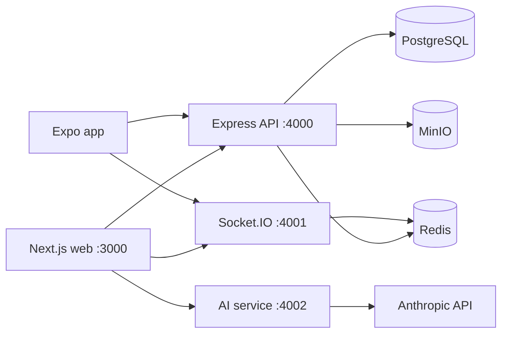

# Devpulse Project Handoff

**Snapshot date:** 2026-09-29  
**Purpose:** Consolidated project status, implemented flows, verification results, and remaining blockers.

## Executive Summary

Devpulse is a pnpm/Turborepo monorepo for a cloud development platform. It combines a Next.js application, Express API, Socket.IO collaboration service, Anthropic-backed AI service, Expo mobile foundation, PostgreSQL/Prisma persistence, Redis state, and MinIO object storage.

The broad product foundation and browser editor are implemented. Recent work adds large-file AI protections, GitHub/Google OAuth using Passport and RS256, and Resend-backed magic-link email with one-time hashed tokens and email rate limiting. Static checks and service-level API tests pass. Real OAuth/email provider exchanges and the full Playwright browser suite still need configured credentials and running infrastructure.

## Architecture



| Workspace | Role | Status |
| --- | --- | --- |
| `apps/web` | Next.js product UI, editor, AI panel, app state | Implemented; editor and auth flows are API-backed |
| `apps/api` | Authentication, persistence, files, revisions, execution, platform endpoints | Express API with tests and typecheck |
| `apps/ai` | Anthropic chat proxy and streaming | Implemented; requires provider key |
| `apps/socket` | Real-time collaboration and presence | Socket.IO service with Redis integration |
| `apps/mobile` | Cross-platform client | Expo foundation; not feature-parity with web |
| `packages/database` | Prisma schema, migrations, seed, client | PostgreSQL schema and migration history |
| `packages/types`, `packages/ui`, `packages/utils`, `packages/config` | Shared types, UI, utilities, and configuration | Shared monorepo packages |

## Achievements

### Platform and product

- Established the pnpm workspace and Turborepo build structure.
- Added the main product shell, login/onboarding, theme selection, repositories, workspaces, deployments, team chat, remote control, pricing, and AI Studio interfaces.
- Added repository search/filtering, creation, deletion, starring, and workspace/devbox workflows.
- Added deployment views for releases, pipelines, logs, previews, environment variables, and operational metrics.
- Added Socket.IO collaboration events for presence, code changes, cursor/selection, and typing state.
- Added Docker Compose services for PostgreSQL, Redis, MinIO, web, API, Socket.IO, AI, and mobile development.

### Editor and AI

- Built a Monaco-based editor workbench with file explorer, tabs, editor status, output panel, command shortcuts, local files/folders, API files, new files, and revision-backed saves.
- Added API/LOCAL/NEW/READONLY file origins, autosave for API files, save promotion for local/new files, and modified-file exit protection.
- Added loading, empty-project, offline, API-error, session-restore, save-conflict, and execution-history behavior.
- Added Docker-isolated code execution for supported languages and stdout/stderr/error/timeout display.
- Added AI chat streaming, context display, slash commands, per-file history, copy, diff preview, language mismatch checks, and apply-to-editor flows.
- Added large-file handling above 500 KiB. “Open anyway” marks the file plaintext and readonly. AI remains disabled unless the user has a non-empty selection under 10,000 bytes; the AI request then includes only that selection, not surrounding file content. The AI panel explains the restriction and changes to a green notice for a qualifying selection.

### Authentication and email

- Added Passport GitHub and Google strategies, session-backed OAuth state, OAuth account linking, workspace provisioning, callback handling, and a Prisma `OAuthAccount` model/migration.
- Added RS256 access and refresh JWT utilities. The access token is held in browser memory and returned to the OAuth callback in a URL fragment that the page removes immediately. Refresh tokens are httpOnly cookies; the shared API client refreshes and retries after a 401.
- Added Resend email helpers for sign-in links, welcome emails, and new-sign-in alerts.
- Magic-link tokens are SHA-256 hashed in Redis, expire after 15 minutes, and are consumed once. Requests are limited to three per normalized email per hour.
- New accounts receive a workspace. Welcome email is sent only on first signup; new-sign-in alert is sent on each production magic-link login.
- Development/test magic-link requests return a token directly and do not send email. Production sends through Resend and cleans up the stored token if delivery fails.
- Added a browser verification page that removes the token from the visible URL before verification and retains the returned access token in memory.

## Main User Flows

### Local setup and application entry

1. Install dependencies, configure `.env`, start Docker infrastructure, apply migrations, and seed the database.
2. Start the web, API, Socket.IO, and AI services.
3. Open the web app at `http://localhost:3000` and enter through login/onboarding.
4. Continue to repositories and choose a repository, workspace, editor, deployment, chat, or remote-control workflow.

### OAuth sign-in

1. The user selects GitHub or Google.
2. The browser redirects to `/api/auth/:provider`.
3. The API stores random OAuth state in its short-lived Redis-backed session and redirects to the provider.
4. The callback validates state, links or creates the provider account, and ensures a workspace membership.
5. The API sets the refresh-token cookie and returns a short-lived access token in a URL fragment.
6. The callback page stores the access token in memory, removes the fragment, and returns to the app. Later API calls use that token and the refresh cookie.

### Magic-link sign-in

1. The login form posts the email to `/api/auth/magic-link/send`.
2. Redis enforces the per-email rate limit and stores only a hash of the random token with a 15-minute TTL.
3. In development/test, the response contains the raw token for local testing. In production, Resend sends the link and the API returns a generic check-email message.
4. The link opens `/auth/verify`; the page removes the query token from the visible URL and posts it to `/api/auth/magic-link/verify`.
5. The API atomically consumes the token, creates the user/workspace if needed, sends welcome/sign-in notifications asynchronously, sets the refresh cookie, and returns an access token.
6. The browser stores the access token in memory and navigates into the app.

### Editor and AI

1. The editor loads project metadata and file content from the API; local and new files use temporary client-side state.
2. The user opens or creates a file, edits it, and saves it. API saves create file revisions.
3. The user can run supported code through the API execution service or ask the AI panel for help.
4. AI responses stream into the panel. Applying code uses a target selector and diff preview before saving.
5. For files over 500 KiB, accepting “Open anyway” switches to readonly plaintext. AI requests require a selection under 10 KB and send only the selected text.

## Playwright Testing

The editor E2E report documents 24 tests in six spec files:

| Spec | Tests | Coverage |
| --- | ---: | --- |
| `file-origins.spec.ts` | 4 | API/local/new file origins, autosave exclusions, before-unload guard |
| `ai-apply.spec.ts` | 5 | Apply targets, diff preview, language mismatch, apply/save, truncated output |
| `usage-limits.spec.ts` | 4 | Normal/low/exhausted usage and unauthenticated state |
| `loading-states.spec.ts` | 5 | Loading delay, empty project, recent files, offline/error, large file |
| `session-restore.spec.ts` | 3 | Active session, local-file exclusion, missing file |
| `save-conflicts.spec.ts` | 3 | Conflict display and resolution choices |
| **Total** | **24** | **Six editor spec files** |

Current harness flow:

1. Playwright creates an isolated browser context.
2. `loginAsDev` calls `/api/auth/dev-bypass`, opens the app, and continues to the editor. It does not rely on the magic-link endpoint.
3. Fixtures create unique projects/files and mock API responses for deterministic cases.
4. Tests assert visible UI, API interactions, loading states, editor behavior, and error handling.

### Latest verification snapshot

| Check | Result | Notes |
| --- | --- | --- |
| API test suite | Passed, 7 tests | Includes RS256 tests, dev/test magic-link token response, and fourth-request rate-limit rejection |
| API TypeScript check | Passed | `pnpm --filter @devpulse/api typecheck` |
| Web TypeScript check | Passed | `pnpm --filter @devpulse/web typecheck` |
| Production web build | Passed | Includes `/auth/callback` and `/auth/verify` routes |
| Prisma validation | Passed | OAuth account schema validates |
| Playwright discovery | Passed | Updated large-file test is listed by the runner |
| Full browser E2E execution | **Not completed** | API/Docker services were unavailable; prior report also records missing/interrupted Chromium installation |
| Resend delivery | **Not exercised** | Requires a valid API key and verified sender domain |
| Live GitHub/Google OAuth | **Not exercised** | Requires provider client credentials and registered callbacks |
| API lint | One error remains | Unused `AiApplyRequest` declaration in `apps/api/src/index.ts`; unrelated/pre-existing |

The Playwright browser suite has not produced a product pass/fail result in this environment. A discovery/list run is not an execution. Start Docker services, migrate/seed the test database, install Chromium, and rerun `pnpm --filter @devpulse/web test:e2e:editor` to obtain browser results.

## Blockers and Known Limitations

### Configuration and environment

- GitHub/Google OAuth requires client IDs/secrets and exact callback URLs. For local GitHub, register `http://localhost:4000/api/auth/github/callback` and request `user:email`.
- Production magic-link email requires a Resend API key and a verified sender domain.
- Dev/test intentionally returns a magic-link token instead of sending email. Real Resend delivery has not been verified in this environment.
- OAuth production uses RS256 keys and a `SESSION_SECRET`; generate keys with `bash apps/api/scripts/generate-keys.sh` and keep them out of Git.
- OAuth account migration must be applied to the target database before OAuth login can persist provider accounts.
- Anthropic-backed chat requires `ANTHROPIC_API_KEY` and the AI service.

### Local infrastructure and E2E

- Full browser tests require Docker Desktop/Engine, PostgreSQL, Redis, MinIO where needed, a migrated/seeded test database, reachable API/web services, and Playwright Chromium.
- In the recorded session, API health was unreachable and `docker compose ps` showed no services, so the browser test did not launch against the app.
- The editor Vitest script currently attempts to collect Playwright specs and fails with the Playwright “test() did not expect to be called here” runner mismatch. Use the Playwright E2E script for browser specs and Vitest for unit tests.
- The API lint command still fails on the unused `AiApplyRequest` declaration.

### Product/infrastructure follow-up

- Devbox provisioning and deployment records exist, but production container orchestration, build workers, and CI/CD execution are still infrastructure work.
- SAML/SSO requires identity-provider configuration.
- Billing screens do not yet persist payment-provider subscriptions.
- The Expo mobile app is a foundation and does not yet mirror the web feature set.
- Repository/workspace/deployment functionality still has simulated/demo behavior where external infrastructure is not connected.

## Setup and Testing Commands

From the repository root:

```powershell
pnpm install
Copy-Item .env.example .env
docker compose up -d postgres redis minio
pnpm --filter @devpulse/database exec prisma migrate deploy
pnpm --filter @devpulse/database db:generate
pnpm seed
```

Generate the API RS256 keypair:

```bash
bash apps/api/scripts/generate-keys.sh
openssl rand -hex 32
```

Set the generated random value as `SESSION_SECRET`. Configure OAuth credentials, `RESEND_API_KEY`, `EMAIL_FROM`, and `EMAIL_FROM_NAME` in `.env`. For Resend, sign up at [resend.com](https://resend.com), verify the sender domain, and create an API key in the dashboard.

Run services:

```powershell
pnpm --filter @devpulse/api dev
pnpm --filter @devpulse/web dev
pnpm --filter @devpulse/socket dev
pnpm --filter @devpulse/ai dev
```

Install Chromium and run editor E2E tests:

```powershell
pnpm --dir apps/web exec playwright install chromium
pnpm --filter @devpulse/web test:e2e:editor
```

Other validation commands:

```powershell
pnpm --filter @devpulse/api test
pnpm --filter @devpulse/api typecheck
pnpm --filter @devpulse/web typecheck
pnpm --filter @devpulse/web build
pnpm --filter @devpulse/database exec prisma validate
```

## Reference Documentation

- [PROJECT_PROGRESS.md](PROJECT_PROGRESS.md): broader project summary, achievements, architecture, and priorities.
- [PROJECT_IMPLEMENTATION_REPORT.md](PROJECT_IMPLEMENTATION_REPORT.md): implementation details and known product limitations.
- [PLAYWRIGHT_EDITOR_E2E_REPORT.md](PLAYWRIGHT_EDITOR_E2E_REPORT.md): test inventory, fixtures, environment requirements, and historical execution blockers.
- [DEVELOPMENT.md](DEVELOPMENT.md): local development, OAuth, Resend, and migration setup.
- [RUNNING_SERVERS.md](RUNNING_SERVERS.md): service startup and health checks.