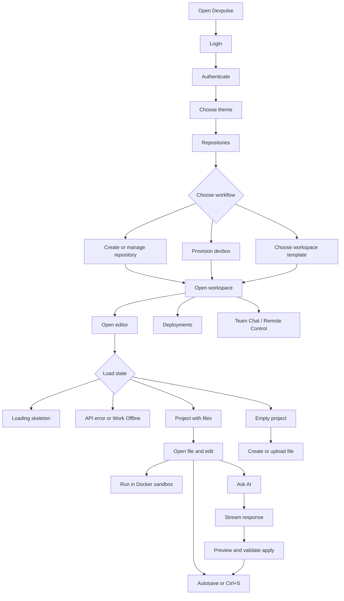
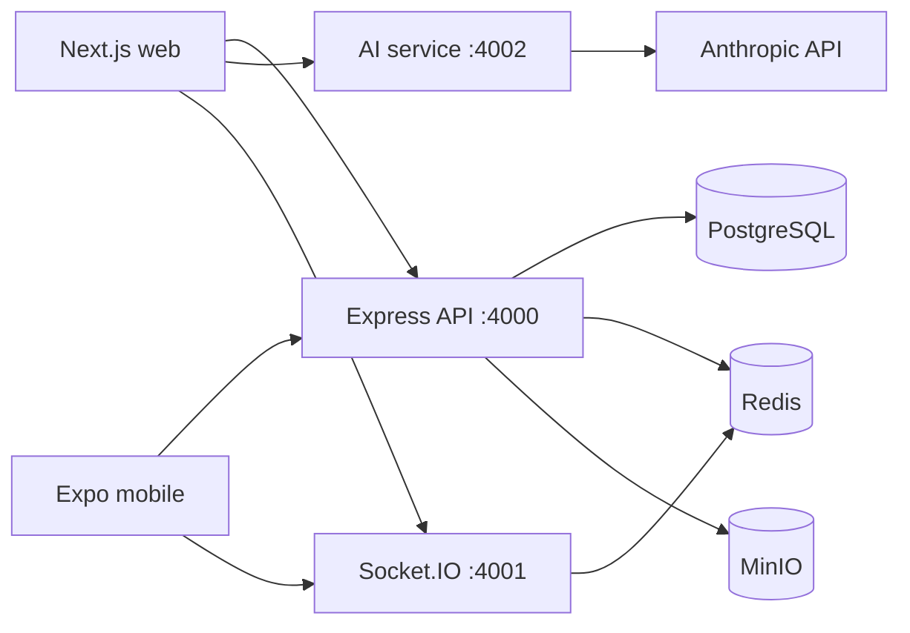

# Devpulse Implementation Report

**Date:** 2026-09-24  
**Repository:** Devpulse  
**Architecture:** pnpm workspace + Turborepo monorepo

## Executive Summary

Devpulse is a cloud development platform combining a Next.js web client, Express API, Anthropic-backed AI service, Socket.IO collaboration service, Expo mobile foundation, PostgreSQL persistence, Redis state, and MinIO object storage.

The product currently has a broad, working platform foundation with a substantially implemented browser editor and AI workflow. The editor supports persistent API files, browser-local files, unsaved session files, revisions, Docker execution, streamed AI assistance, validated AI apply flows, loading and empty states, and usage visibility.

The main remaining work is production hardening and infrastructure integration: real OAuth/SAML/email providers, secure workspace/container orchestration, CI/CD workers, billing persistence, complete mobile parity, and browser-level regression coverage.

## Repository Structure

| Area | Location | Responsibility |
| --- | --- | --- |
| Web | `apps/web` | Next.js application, screens, AppContext, editor workbench |
| API | `apps/api` | Auth, persistence, files, revisions, execution, platform endpoints |
| AI | `apps/ai` | Anthropic proxy and streamed chat responses |
| Socket | `apps/socket` | Socket.IO collaboration and workspace sessions |
| Mobile | `apps/mobile` | Expo client foundation |
| Database | `packages/database` | Prisma schema, migrations, seed, database client |
| Shared types | `packages/types` | Shared TypeScript package boundary |
| Shared UI | `packages/ui` | Shared UI package boundary |
| Utilities | `packages/utils` | Shared utility package boundary |
| Configuration | `packages/config` | Shared TypeScript, ESLint, and Tailwind configuration |

## Completed Product Areas

### Authentication and onboarding

- Login experience with GitHub, GitLab, SSO/SAML, and work-email entry points.
- Development magic-link and provider-bypass flows.
- HTTP-only JWT session handling through the API.
- Theme selection and onboarding progression.
- Global application shell with navigation, profile access, status indicators, and repository/branch context.
- Command palette entry point.

### Repositories and workspaces

- Repository listing, search, language filtering, and starred filtering.
- Repository creation, deletion, starring, clone URL copying, and deployment navigation.
- Devbox creation from repositories and supported templates.
- Workspace status controls, deletion, resource information, port details, preview URLs, and local-machine connection messaging.
- Supported template directions for Next.js, FastAPI, Rust, Go, and PyTorch.

### Editor workbench

- VS Code-inspired fixed layout with tabs, 208px explorer, Monaco editor, optional AI drawer, output panel, and status bar.
- Monaco `devpulse-dark` theme, JetBrains Mono, minimap, line numbers, bracket pair colorization, smooth scrolling, and existing editor behavior preserved.
- File explorer with folders, Lucide file icons, refresh, context actions, dirty indicators, and file opening.
- Tabs with active state, dirty state, close action, and middle-click close.
- Browser File API file and folder loading.
- New-file creation, deletion, renaming, and API-backed project files.
- Revision-backed file saves through `PATCH /v1/files/:fileId`.
- API, LOCAL, NEW, and READONLY file origins.
- Origin badges in tabs and origin styling in the explorer.
- API files are persistent and eligible for two-second debounced autosave.
- Local and new files remain in browser memory until explicitly saved to the project.
- Local/new save promotion uses POST followed by PATCH and replaces temporary IDs with database IDs.
- Read-only files are blocked in Monaco and cannot be saved.
- Before-unload protection for modified local/new files.
- Loading skeletons for the explorer, tabs, and editor area.
- Empty project state with New File, Upload Files, and Open Folder actions.
- No-active-file state with recent files and quick actions.
- API error state with Retry and Work Offline actions.
- Recent file paths persisted per project in localStorage.
- Large-file warning for files over 500 KiB, with Open anyway and Close actions.
- Large files use plaintext mode when opened anyway and disable AI submission while blocked.

### Code execution

- Execution request through the API.
- Docker-isolated execution path for JavaScript, Python, Rust, and Go.
- Terminal/output/problems tabs.
- Run button disabled while executing with a spinner.
- Running cursor, language status, live elapsed time, timeout messaging after ten seconds, exit code, and completion duration.
- stdout, stderr, execution errors, and exit status rendering.

### AI coding workflow

- AI drawer with SSE streaming and JSON fallback.
- Claude model badge: `claude-sonnet-4-6`.
- User/assistant message alignment.
- Copy code response action.
- Active file, cursor, selection, project, language, branch, selected-code, and surrounding-code context.
- Rich live context indicator with file, language, line, column, selection count, branch, and clear control.
- Pulsing Zap during streaming.
- Three shimmer placeholders until the first streamed chunk arrives.
- Slash command autocomplete with keyboard navigation, Enter selection, and Escape dismissal.
- Supported commands: `/fix`, `/explain`, `/test`, `/comment`, `/refactor`, and `/optimize`.
- Commands are included in the AI request body and command pills appear on user messages.
- Selection-required commands show a tip when no code is selected.
- Per-file, session-local conversation history in localStorage, limited to the latest twenty messages.
- History loading on file switch, previous-message disclosure, clear-history action, and local-history tooltip.
- AI usage meter backed by `GET /v1/ai/usage` with five-minute polling.
- Free/Pro limits, progress bar colors, low-usage warning, disabled input at the limit, and upgrade affordance.

### AI apply-to-editor flow

- Captures Monaco selection when the AI request is sent.
- Applies only the captured selection when a selection exists.
- Offers selection, cursor insertion, or whole-file replacement when no selection exists.
- Shows a scrollable mini diff before applying.
- Highlights removed lines in red and added lines in green.
- Compares fenced AI language with the active file language.
- Requires confirmation for language mismatch.
- Marks the file modified, saves through the existing revision path, and shows `AI code applied and saved` feedback.
- Shows retry guidance when content was applied but saving failed.

### Deployments and operations

- Deployment cards with branch, commit, status, target, timestamp, and duration.
- Release creation and pipeline rerun actions.
- Deployment views for overview, releases, environment variables, preview branches, pipelines, and access/audit information.
- Environment variable creation, deletion, search, masking, reveal, and copy actions.
- Deployment logs with clear and auto-scroll behavior.
- Operational metrics for latency, container health, success rate, and synchronization.
- Deploy-on-push and ephemeral preview controls.

### Collaboration

- Team channels and direct messages.
- Online presence, message composition, code snippets, attachments, reactions, roles, and avatars.
- Remote Control workspace with shared screen panes, shared code, host/controller identities, session timing, latency, typing presence, microphone, camera, and session controls.
- Socket.IO rooms, Redis-backed presence/session state, code-change broadcasts, cursor/selection events, and typing events.

### Platform foundation

- pnpm workspace and Turborepo setup.
- Shared TypeScript, ESLint, Tailwind, types, UI, database, and utility packages.
- Express API with Helmet, CORS, request logging, health/readiness checks, authentication, CRUD endpoints, file revisions, artifacts, repositories, workspaces, deployments, environments, and execution.
- AI service with Anthropic integration, health endpoint, and `/v1/chat` forwarding.
- Prisma schema for users, workspaces, memberships, projects, files, revisions, channels, messages, usage, and related relationships.
- Docker Compose topology for PostgreSQL, Redis, MinIO, web, API, Socket.IO, AI, and mobile development.
- Expo mobile shell for Android, iOS, and web targets.

## End-to-End User Flow



### Editor flow details

1. The web client enters the editor and `AppContext` discovers or creates a project.
2. The project file list and file contents are fetched from the API.
3. API files receive `origin: API`, persistent IDs, file versions, and content.
4. Native browser file imports receive temporary IDs and `origin: LOCAL`.
5. New files receive temporary IDs and `origin: NEW`.
6. Editing updates browser content and marks the file modified.
7. API files autosave after two seconds of inactivity.
8. Local/new files require explicit promotion through a save dialog or new-file path prompt.
9. Saves update file version metadata and create file revisions.
10. Closing all tabs exposes recent files and quick actions instead of a blank editor.

### AI flow details

1. The user opens the AI drawer and usage is fetched.
2. The user may select code, choose a slash command, and submit a prompt.
3. The web client sends command and context metadata to `/v1/ai/chat`.
4. The API validates usage and forwards the request to the AI service.
5. The AI service forwards the request to Anthropic and streams SSE chunks back.
6. The UI renders the assistant response incrementally.
7. Apply opens a target selector when needed, previews the diff, checks language compatibility, and asks for confirmation on mismatch.
8. The validated result updates the active editor file and is saved through the revision-backed API path.
9. Conversation history remains local to the browser and is keyed by file ID.

## Service and Data Architecture



### Persistence and transient state

- PostgreSQL stores users, workspaces, memberships, projects, files, file revisions, channels, messages, deployments, and AI usage records.
- Redis stores short-lived magic-link state, presence, collaboration sessions, and execution-related transient state.
- MinIO stores larger project artifacts.
- Browser localStorage stores recent editor file paths and per-file AI history.
- React/AppContext stores active editor state, open tabs, content, UI state, and local-only files during a session.

## Main API Endpoints

| Method | Endpoint | Purpose |
| --- | --- | --- |
| GET | `/v1/projects` | Discover projects |
| POST | `/v1/projects` | Create a project |
| GET | `/v1/projects/:projectId/files` | List project files |
| GET | `/v1/projects/:projectId/files/:fileId` | Read file content |
| POST | `/v1/projects/:projectId/files` | Create a file |
| PATCH | `/v1/files/:fileId` | Save, rename, move, or change language |
| DELETE | `/v1/files/:fileId` | Delete a file |
| POST | `/v1/execute` | Execute source in the Docker sandbox |
| POST | `/v1/ai/chat` | Stream AI responses |
| GET | `/v1/ai/usage` | Read monthly AI usage |
| GET/POST | `/v1/repositories` | Repository management |
| GET/POST | `/v1/devboxes` | Workspace/devbox management |
| GET/POST | `/v1/deployments` | Deployment management |
| GET/POST | `/v1/environment-variables` | Environment variable management |

## Validation Performed

The following checks passed during implementation:

```powershell
pnpm --filter @devpulse/web typecheck
pnpm --filter @devpulse/api typecheck
```

Existing project documentation also identifies these standard validation commands:

```bash
make build
make test
make lint
make typecheck
```

## Blockers and Known Limitations

### Infrastructure and deployment blockers

- Production OAuth requires provider credentials, registered callbacks, and deployed secrets.
- Production SAML/SSO still requires identity-provider configuration.
- Production magic-link email delivery requires an email provider integration.
- Devbox records and deployment records persist, but the underlying secure container fleet and CI/build workers remain infrastructure stubs.
- Real framework boot workflows for Next.js, FastAPI, and PyTorch need dedicated project runners.
- Docker Desktop and the local PostgreSQL, Redis, and MinIO services are required for full local integration.
- Anthropic-backed responses require `ANTHROPIC_API_KEY` and a running AI service.
- Billing is currently a client-side pricing experience without payment-provider persistence.
- The mobile application is a foundation and does not yet mirror all web workflows.

### Testing and operational gaps

- Browser-level interaction tests were not run for the latest editor/AI changes.
- Monaco selection, AI apply previews, localStorage history, usage-limit states, and before-unload behavior should receive Playwright coverage.
- End-to-end tests should cover API failure, offline mode, slow loading, large files, execution timeouts, SSE disconnects, and save conflicts.
- Usage endpoint behavior should be tested for Free, Pro, exhausted, and unauthenticated cases.
- Runtime validation still depends on the configured local services and credentials.

### Product follow-up

- Add real upgrade navigation for the usage meter.
- Add a user-facing AI context history reset policy beyond browser localStorage if cross-device history is later required.
- Add stronger server-side patch/apply validation and conflict handling for concurrent edits.
- Add robust binary-file detection and content-size enforcement before reading browser files.
- Add accessibility review for keyboard navigation, focus management, dialogs, autocomplete, and diff preview.

## Local Development

### Requirements

- Node.js 20.10 or newer.
- pnpm 9.15 or newer through Corepack.
- Docker Desktop.

### Standard startup

```powershell
corepack enable
pnpm install
copy .env.example .env
docker compose up -d postgres redis minio
pnpm migrate
pnpm seed
pnpm dev
```

### Local service URLs

| Service | URL |
| --- | --- |
| Web | http://localhost:3000 |
| API | http://localhost:4000 |
| API health | http://localhost:4000/health |
| Socket health | http://localhost:4001/health |
| AI health | http://localhost:4002/health |
| MinIO console | http://localhost:9001 |

## Primary Reference Files

- [README.md](README.md) - quick start and project summary.
- [DEVELOPMENT.md](DEVELOPMENT.md) - setup, services, and commands.
- [PROJECT_DOCUMENTATION.md](PROJECT_DOCUMENTATION.md) - architecture and API notes.
- [PROJECT_PROGRESS.md](PROJECT_PROGRESS.md) - progress and priorities.
- [apps/web/app/page.tsx](apps/web/app/page.tsx) - top-level page routing.
- [apps/web/app/context/AppContext.tsx](apps/web/app/context/AppContext.tsx) - shared web state and editor persistence.
- [apps/web/app/components/EditorWorkbench.tsx](apps/web/app/components/EditorWorkbench.tsx) - editor, execution, loading states, and AI workflow.
- [apps/api/src/index.ts](apps/api/src/index.ts) - API routes, validation, persistence, and AI proxy.
- [apps/ai/src/index.ts](apps/ai/src/index.ts) - Anthropic-backed AI service.
- [apps/socket/src/index.ts](apps/socket/src/index.ts) - real-time collaboration service.
- [packages/database/prisma/schema.prisma](packages/database/prisma/schema.prisma) - persistence model.
- [docker-compose.yml](docker-compose.yml) - local infrastructure topology.

## Recommended Next Steps

1. Add Playwright coverage for the editor and AI workflows.
2. Test full API/AI execution with Docker, PostgreSQL, Redis, MinIO, and Anthropic credentials.
3. Replace simulated workspace/deployment infrastructure with production workers.
4. Harden authentication, provider callbacks, secrets, and email delivery.
5. Add real billing persistence and upgrade flow.
6. Expand mobile workflows and establish web/mobile shared contracts.
