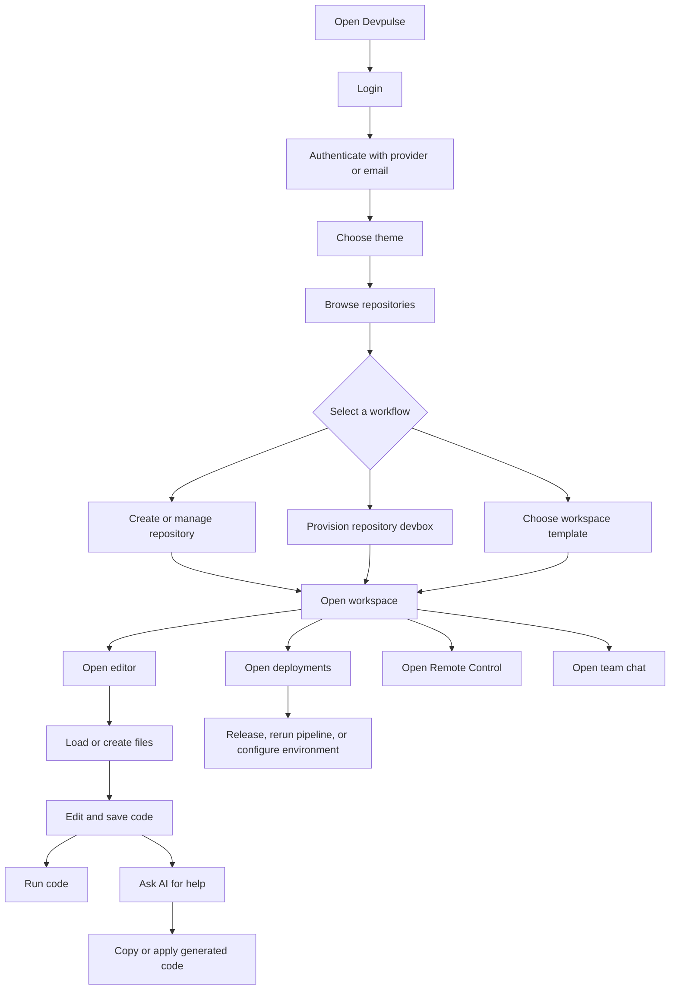
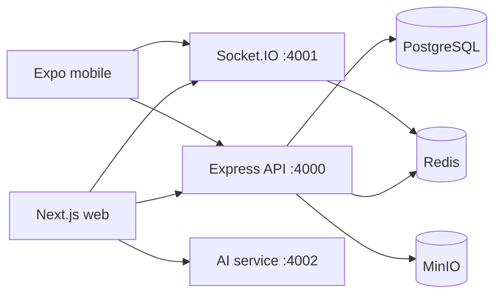

# Devpulse Project Progress

## 1. Project Summary

Devpulse is a Turborepo monorepo for a cloud development platform. It brings together:

- Cloud workspaces and isolated development environments.
- Git repositories, branches, and repository management.
- Browser-based source editing.
- AI-assisted coding and code execution.
- Deployments, pipelines, logs, and environment variables.
- Team messaging and collaborative remote control.
- A mobile client foundation.

The project includes a Next.js web application, Express API, Socket.IO service, Anthropic-backed AI service, Expo mobile client, PostgreSQL persistence, Redis state, and MinIO object storage.

## 2. Work Completed

### Product and interface

- Created the Devpulse sign-in experience with GitHub, GitLab, SSO/SAML, and work-email options.
- Added development authentication support through magic links and provider bypass flows.
- Added onboarding from authentication to theme selection and repository management.
- Built a consistent developer-tool interface with responsive layouts and Lucide icons.
- Added the global application shell with navigation, repository and branch context, status indicators, profile access, and sidebar navigation.
- Added command palette access through the application shell.
- Added theme selection with primary, secondary, tertiary, and neutral color tokens.
- Added monthly and annual pricing views with Free, Pro, and Enterprise plans.

### Repositories and workspaces

- Added repository listing, search, language filtering, and starred-repository filtering.
- Added repository creation, deletion, starring, clone URL copying, and deployment navigation.
- Added devbox provisioning from existing repositories.
- Added template-based workspace provisioning for Next.js, FastAPI, Rust, Go, and PyTorch workloads.
- Added local-machine connection messaging with CLI and WireGuard-oriented setup information.
- Added workspace status controls, deletion, resource details, port information, and preview URLs.

### Editor and AI development

- Built a VS Code-inspired browser editor workbench.
- Added local file loading through the browser File API.
- Added local folder loading through the browser directory picker.
- Added file creation, deletion, open-file tabs, dirty-file state, and editable file contents.
- Connected editor projects and file operations to the API and Prisma persistence.
- Added revision-backed file saves.
- Added Docker-isolated execution for JavaScript, Python, Rust, and Go.
- Added execution output for stdout, stderr, exit code, timeout, and errors.
- Added an in-editor AI drawer backed by the AI service.
- Added AI Studio with model selection, context controls, temperature and top-p settings, copy actions, and editor apply navigation.
- Added a shared code context model for active files, projects, packages, and branches.

### Monaco Editor Workbench completion

- Reworked `EditorWorkbench.tsx` into the fixed Devpulse workbench layout: 40px tabs, 208px explorer, Monaco editor, optional 320px AI panel, 176px output panel, and 28px purple status bar.
- Added extension-aware file icons using Lucide icons for TypeScript, JavaScript, CSS, SCSS, JSON, Markdown, Python, HTML, and fallback files.
- Added active-file styling, modified-file dots, expandable folders, explorer refresh, and right-click actions for new file, rename, delete, and copy path.
- Updated tabs to display filenames only, with horizontal scrolling, active styling, dirty indicators, hover close buttons, and middle-click close support.
- Added the `devpulse-dark` Monaco theme with the requested Devpulse colors, JetBrains Mono typography, ligatures, minimap, line numbers, bracket colorization, smooth scrolling, and editor padding.
- Added keyboard handlers for save, file search, output toggle, AI toggle, command palette, and line comments.
- Added terminal, output, and problems tabs with run, clear, execution status, exit code, stdout, stderr, error coloring, and a running cursor indicator.
- Added the AI panel header, model badge, aligned user and assistant messages, code response language labels, copy feedback, apply-to-editor action, slash command hints, and active-file context.
- Added SSE streaming support from the AI service with incremental response rendering, a pulsing Zap indicator, cancellation of the previous request, and JSON fallback compatibility.
- Preserved revision persistence by routing save and apply actions through `PATCH /v1/files/:fileId`; the API transaction increments the file version and creates a `FileRevision`.
- Validated the web and AI packages with TypeScript checks and `git diff --check`.

### Deployments and operations

- Added deployment cards with branch, commit, status, target, timestamp, and duration information.
- Added new production release and pipeline rerun actions.
- Added deployment views for overview, releases, environment variables, preview branches, pipelines, and access or audit information.
- Added environment-variable creation, deletion, search, masking, reveal, and copy actions.
- Added deployment logs with clear and auto-scroll behavior.
- Added operational metrics for latency, container health, success rate, and synchronization.
- Added deploy-on-push and ephemeral preview branch controls.

### Collaboration

- Added team channels and direct-message navigation.
- Added online presence indicators, message composition, code snippets, attachments, reactions, roles, and avatars.
- Added a Remote Control workspace with shared screen panes, editable code, host and controller identities, session timing, latency, typing presence, microphone controls, camera controls, and session termination.
- Added Socket.IO workspace rooms with Redis-backed presence and session state.
- Added real-time code-change, cursor, selection, and typing events.

### Platform foundation

- Established the pnpm workspace and Turborepo structure.
- Added shared TypeScript, ESLint, Tailwind, types, database, UI, and utility packages.
- Added an Express API with Helmet, CORS, JSON parsing, request logging, health checks, readiness checks, authentication, project and file CRUD, revision-backed saves, artifact uploads, repository actions, devbox actions, deployment actions, environment variables, and execution endpoints.
- Added an AI service with an Anthropic integration and `/v1/chat` endpoint.
- Added a Prisma PostgreSQL schema for users, workspaces, memberships, projects, files, revisions, channels, and messages.
- Added Docker Compose services for PostgreSQL, Redis, MinIO, web, API, Socket.IO, AI, and mobile development.
- Added development, build, test, lint, typecheck, migration, seed, and Prisma Studio commands.
- Added the Expo mobile application shell for Android, iOS, and web targets.

## 3. End-to-End Application Flow



### Flow details

1. **Application entry:** The web application starts with the login page. `AppContext` owns the current page, identity, themes, repositories, workspaces, editor state, deployments, and collaboration state.
2. **Authentication:** Users can begin with GitHub, GitLab, SSO/SAML, or email. Development mode supports local provider bypass and magic-link verification. Successful authentication creates an HTTP-only JWT session.
3. **Theme setup:** The user selects a theme and applies the design tokens before entering the main platform.
4. **Repository management:** The user searches repositories, filters results, creates or deletes repositories, stars repositories, copies clone URLs, and starts a workspace workflow.
5. **Workspace provisioning:** A workspace can be created from a repository URL, a supported template, or a local-machine connection. The workspace exposes status, resources, ports, and preview information.
6. **Editor workflow:** The editor discovers or creates a project, loads file metadata and content, opens files in tabs, accepts local files or folders, creates files, edits content, saves revisions, and deletes files through the API.
7. **Execution workflow:** The user runs supported source code through the execution endpoint. The API starts an isolated Docker execution and returns output, errors, exit code, and timeout information.
8. **AI workflow:** The editor or AI Studio sends project, file, branch, and user-request context to the AI service. Streaming responses arrive as SSE text chunks, while non-streaming JSON remains supported. The response can be copied or applied back to the active editor file, creating a new revision.
9. **Delivery workflow:** The deployments area shows release state, build information, logs, pipelines, environment variables, preview branches, and operational metrics.
10. **Collaboration workflow:** Team Chat handles channels and direct messages. Remote Control uses Socket.IO rooms and Redis-backed state for shared code, presence, cursor, typing, audio, and video controls.
11. **Mobile workflow:** The Expo application provides the mobile client foundation and can target Android, iOS, or web. The full mobile product workflow is still planned.

## 4. Technical Architecture



### Main application responsibilities

| Application | Responsibility | Current state |
| --- | --- | --- |
| Web | Main product interface and application state | Implemented with API-backed editor behavior and local fallback state |
| API | Authentication, persistence, file operations, execution, and platform endpoints | Implemented as an Express service |
| Socket | Real-time collaboration and workspace sessions | Implemented with Socket.IO and Redis integration |
| AI | Anthropic request proxy | Implemented with health and chat endpoints |
| Mobile | Cross-platform client foundation | Expo starter shell implemented |
| Database | PostgreSQL persistence through Prisma | Schema, migration, seed, and client setup implemented |

## 5. Data and Service Flow

1. The web client calls the API for authentication, projects, files, repositories, workspaces, deployments, and environment variables.
2. The API validates request data with Zod and uses Prisma for PostgreSQL persistence.
3. File saves update the file version and create an immutable `FileRevision` in one transaction.
4. Larger project artifacts are stored in MinIO.
5. Redis stores short-lived execution results, magic-link state, presence, and collaboration session state.
6. The Socket.IO service broadcasts workspace events to connected participants.
7. AI requests move from the web client to the AI service and then to Anthropic.
8. Streaming AI requests return SSE `data:` events from the AI service and are appended to the active assistant message as chunks arrive.
9. Code execution is routed to an isolated Docker sandbox with resource and timeout limits.

## 6. Current Status

### Implemented and demonstrable

- Web navigation and screen composition.
- Authentication entry points and development authentication flows.
- Repository and workspace management interfaces.
- Persistent editor projects, files, saves, revisions, imports, and deletes.
- Completed Monaco workbench layout, file explorer, tabs, custom theme, shortcuts, output panel, and AI drawer streaming.
- AI requests and code execution across service boundaries.
- Remote Control Socket.IO session and collaboration events.
- API, Socket.IO, and AI health endpoints.
- Prisma data model and initial database migration.
- Docker Compose local service topology.
- Development, build, lint, test, typecheck, migration, and seed workflows.

### Still foundational or simulated

- Production SAML/SSO, OAuth credentials, and email delivery need provider configuration.
- Repository, devbox, deployment, and environment actions use the API when available and local demo state when it is unavailable.
- Devbox provisioning and deployment records persist, but the underlying container fleet and CI workers remain infrastructure stubs.
- Framework boot workflows for Next.js, FastAPI, and PyTorch need dedicated project runners.
- AI streaming requires `ANTHROPIC_API_KEY`; without provider configuration the UI reports the service error while retaining the JSON-compatible request path.
- Billing is currently a client-side pricing experience without payment-provider persistence.
- The mobile application does not yet mirror the complete web workflow.

## 7. Local Development Flow

Requirements:

- Node.js 20.10 or newer.
- pnpm 9.15 or newer.
- Docker Desktop.

Standard startup:

```bash
corepack enable
pnpm install
copy .env.example .env
docker compose up -d postgres redis minio
pnpm migrate
pnpm seed
pnpm dev
```

Important local endpoints:

- Web: `http://localhost:3000`
- API health: `http://localhost:4000/health`
- Socket health: `http://localhost:4001/health`
- AI health: `http://localhost:4002/health`
- MinIO console: `http://localhost:9001`

Validation commands:

```bash
make build
make test
make lint
make typecheck
```

## 8. Next Implementation Priorities

1. Connect all remaining screens to authenticated API contracts and persistent Prisma data.
2. Replace simulated devbox provisioning with secure workspace infrastructure.
3. Replace deployment stubs with real build workers and release execution.
4. Add production OAuth, SAML, email delivery, secrets, and callback configuration.
5. Add stronger patch validation before applying streamed AI code.
6. Add dedicated framework runners for supported templates.
7. Add payment-provider persistence for billing plans.
8. Expand the mobile client to cover repositories, workspaces, editor, deployments, and collaboration.

## 9. Reference Files

- [README.md](README.md): project summary and quick start.
- [DEVELOPMENT.md](DEVELOPMENT.md): development commands and service setup.
- [PROJECT_DOCUMENTATION.md](PROJECT_DOCUMENTATION.md): detailed architecture, API, data model, and implementation notes.
- [apps/web/app/page.tsx](apps/web/app/page.tsx): top-level web page routing.
- [apps/web/app/context/AppContext.tsx](apps/web/app/context/AppContext.tsx): shared web state and cross-screen actions.
- [apps/web/app/components/AppShell.tsx](apps/web/app/components/AppShell.tsx): global navigation and application shell.
- [apps/web/app/components/EditorWorkbench.tsx](apps/web/app/components/EditorWorkbench.tsx): browser editor, execution, and AI workflow.
- [apps/api/src/index.ts](apps/api/src/index.ts): HTTP API foundation.
- [apps/socket/src/index.ts](apps/socket/src/index.ts): real-time collaboration foundation.
- [apps/ai/src/index.ts](apps/ai/src/index.ts): AI service endpoint.
- [packages/database/prisma/schema.prisma](packages/database/prisma/schema.prisma): persistence model.
- [docker-compose.yml](docker-compose.yml): local infrastructure topology.
